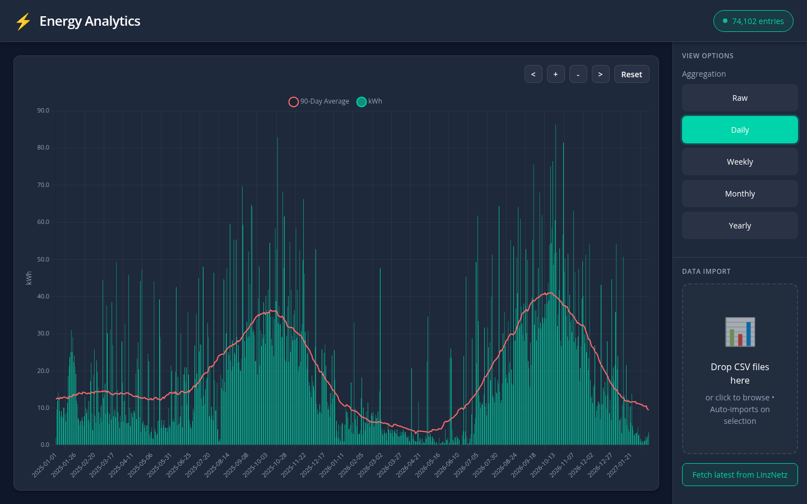

# Energy Tracker

[](https://github.com/fabianwimberger/linznetz-energy-tracker/actions)
[](https://github.com/fabianwimberger/linznetz-energy-tracker/pkgs/container/energy-tracker)
[](https://opensource.org/licenses/MIT)

A self-hosted dashboard for visualizing electricity consumption from Austrian
smart meter (Smart Meter / Intelligenter Zähler) CSV exports.

<p align="center">
  
  <br><em>Daily view with 90-day moving average and seasonal trends</em>
</p>

## Background

Austrian grid operators (Netzbetreiber) provide smart-meter data as raw CSV
files — either quarter-hourly intervals or daily totals. These exports are
accurate, but reading them in a spreadsheet to spot trends, compare seasons, or
estimate your next bill is tedious. Energy Tracker turns those CSV drops into
interactive charts with moving averages and simple forecasts so you can actually
see what is happening.

## Features

- **Quarter-hourly raw view** with your average daily load pattern overlaid
- **Daily / weekly / monthly / yearly** aggregations with moving averages
- **Simple linear forecast** for the current week, month, or year
- **Duplicate import detection** via SHA-256 hashing
- **Handles both formats** from Austrian grid operators:
  - `Datum von / Datum bis / Energiemenge in kWh` (quarter-hourly)
  - `Datum / Energiemenge in kWh` (daily)
- **SQLite** — no external database required

## Quick Start

### Option 1: Using Pre-built Image (Recommended)

Pre-built images support both **AMD64** and **ARM64** architectures.

**Docker Compose:**

```bash
# Clone the repository for docker-compose.yml
git clone https://github.com/fabianwimberger/linznetz-energy-tracker.git
cd linznetz-energy-tracker

# Run with pre-built image
docker compose up -d

# Open UI at http://localhost:8000
```

**Or with docker run:**

```bash
docker run -d \
  --name linznetz-energy-tracker \
  --restart unless-stopped \
  -p 8000:8000 \
  -v linznetz-energy-tracker-data:/app/data \
  -e TZ=Europe/Vienna \
  ghcr.io/fabianwimberger/linznetz-energy-tracker:latest
```

### Option 2: Build from Source

```bash
# Clone the repository
git clone https://github.com/fabianwimberger/linznetz-energy-tracker.git
cd linznetz-energy-tracker

# Copy the override file to build locally
cp docker-compose.override.yml.example docker-compose.override.yml

# Build and run
make build
make up

# Or using docker compose directly:
# docker compose build
# docker compose up -d

# Open UI at http://localhost:8000
```

### Available Image Tags

The following image tags are available from `ghcr.io/fabianwimberger/linznetz-energy-tracker`:

| Tag | Description |
|-----|-------------|
| `main` | Latest development build from main branch |
| `v1.2.3` | Specific release version |
| `v1.2` | Latest patch release in the v1.2.x series |
| `v1` | Latest minor release in the v1.x.x series |
| `<short-sha>` | Specific commit SHA (e.g. `abc1234`) |

### Updating

```bash
# Pull latest image
docker compose pull
docker compose up -d

# Or with docker run
docker pull ghcr.io/fabianwimberger/linznetz-energy-tracker:latest
docker restart linznetz-energy-tracker
```

## Configuration

All configuration is via environment variables. Defaults are fine for a local
deployment.

| Variable       | Default           | Purpose                                           |
| -------------- | ----------------- | ------------------------------------------------- |
| `PORT`         | `8000`            | Host port for the web UI                          |
| `TZ`           | `Europe/Vienna`   | Container timezone                                |
| `DATA_DIR`     | `/app/data`       | Directory for SQLite database and upload staging  |
| `DATABASE_URL` | derived           | SQLAlchemy async URL (override to use a custom path) |
| `STATIC_DIR`   | `/app/static`     | Directory served at `/static`                     |
| `CORS_ORIGINS` | `*`               | Comma-separated allowed origins                   |

## Production Deployment

The bundled `docker-compose.yml` is a minimal standalone setup. For
production, put reverse-proxy config, TLS, and auth in a local
`docker-compose.override.yml` (already gitignored), for example:

```yaml
services:
  app:
    ports: !reset []
    labels:
      - traefik.enable=true
      - traefik.http.routers.energy.rule=Host(`energy.example.com`)
      - traefik.http.routers.energy.tls.certresolver=letsencrypt
    networks:
      - reverse-proxy
    environment:
      CORS_ORIGINS: https://energy.example.com

networks:
  reverse-proxy:
    external: true
```

The app has no built-in authentication — put it behind something (OIDC proxy,
basic auth, Tailscale, etc.) before exposing it to the internet.

## CSV Format

The importer auto-detects two formats based on headers:

**Quarter-hourly** (one row per 15-minute interval)

```
Datum von;Datum bis;Energiemenge in kWh
01.01.2025 00:00;01.01.2025 00:15;0,123
...
```

**Daily summary** (one row per day)

```
Datum;Energiemenge in kWh
01.01.2025;12,345
...
```

Decimal values use a comma as separator. The delimiter (`;` / `,` / tab) is
auto-detected.

## Development

```bash
pip install -r requirements.txt -r requirements-dev.txt
make setup        # Download vendor libraries
make test         # Run the test suite
make lint         # Run linters
make typecheck    # Run type checker
make format       # Format code

# Run locally
DATA_DIR=./data STATIC_DIR=./static python app.py
```

## License

MIT — see [LICENSE](LICENSE).

### Third-Party Licenses

This software includes the following open-source components:

| Component | License | Source |
|-----------|---------|--------|
| Chart.js | [MIT](https://github.com/chartjs/Chart.js/blob/master/LICENSE) | https://github.com/chartjs/Chart.js |
| chartjs-plugin-zoom | [MIT](https://github.com/chartjs/chartjs-plugin-zoom/blob/master/LICENSE) | https://github.com/chartjs/chartjs-plugin-zoom |
| Flatpickr | [MIT](https://github.com/flatpickr/flatpickr/blob/master/LICENSE.md) | https://github.com/flatpickr/flatpickr |
